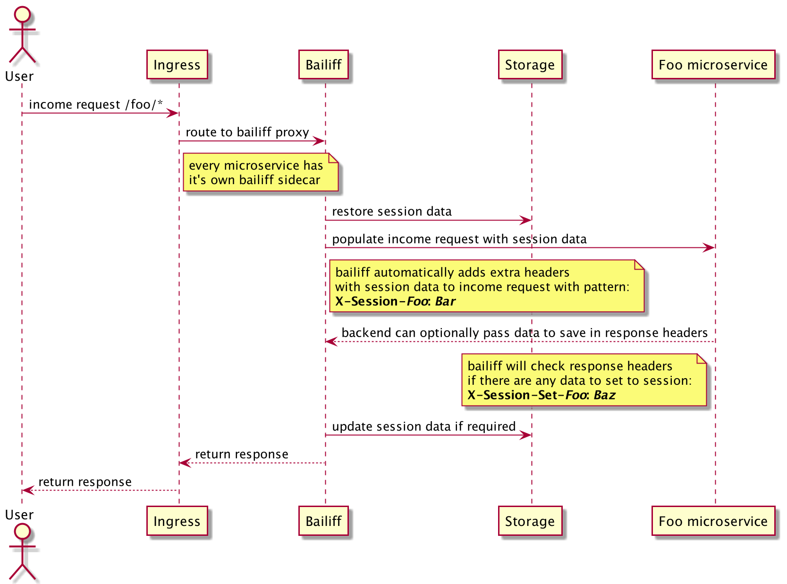

# bailiff 

Sidecar for distributed session layer for microservices

## Problem

When heaving deal with storing user's data between requests there are two basic variants how to do that:

- passing data in every request (`JWT`, raw values in `Cookie` header)
- storing data in some storage (files, memory, external db, etc) by some ID of _session_, with passing __only__ this ID in request data

There are tons of articles on the internet with pros and cons of both variants, so we will not stop on this.
The one thing that need to be said is that implementing session pattern in microservices environment could be quite tricky.
So here comes __bailiff__.

## Solution

__Bailiff__ is a sidecar for your backend apps which takes the routine of saving and restoring session data.
On every income request it checks if there is a session.
If so bailiff enriches request by passing new headers with session data (see example below).
Also, bailiff checks every response if there are any data to save or update in session.

All bailiff sidecars are connected with single storage, so all session data is shared between all microservices.
So if microservice Foo saved `userID` in session, microservice Bar will get it in next request.

Please see example below:

## Install

TODO...
